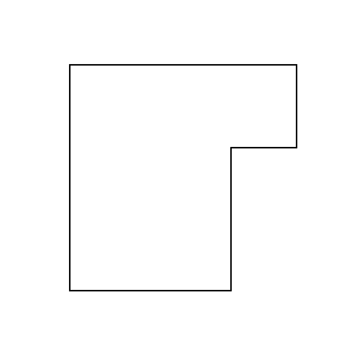

# matlab-2d-room-simulator
A 2D room simulator which simulates point cloud sampling and depth map acquisition given a 2D floor plan

## Instructions

1. Change the file path `fp2.png` to the floor plan of your choice. The floor plan needs to be **grayscale** with **walls:black** and **space:white**.

2. 
   * Mixed
   * Mixed  
3. Item
